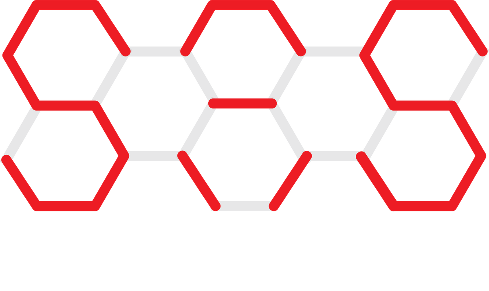
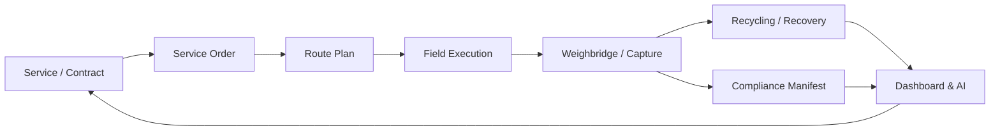

<p align="center">
  
</p>

<h1 align="center">ECOFLOW by SA Systems</h1>

<p align="center">
  <strong>The operations-first ERP for waste management, recycling and the circular economy — built on Odoo.</strong>
</p>

<p align="center">
  
  
  
  
</p>

---

## Overview

**ECOFLOW** turns a waste hauler into a **data-driven environmental operations platform**.
Every bin lifted, every kilometre driven, every tonne recovered and every compliance
event is captured **once**, reconciled automatically, and surfaced as an operational
decision. The suite ships as **seven focused Odoo modules** that install cleanly on a
single Odoo database and run identically on **Odoo 18.0 and 19.0** from one codebase.

It is **global by design**: prices and recovered-value figures are **multi-currency as
standard**, and a built-in **regional profile** tailors the regulatory framework, units
and default currency to your market (EU, UK, US, Australia, GCC/MENA, India, or a
generic global preset).

> Operational Efficiency Index (OEI)
> `(Serviced Stops × Recovery Rate × On-Time %) ÷ (Fleet + Labour + Disposal + Compliance Cost)`
> — every module is justified by its contribution to OEI.

---

## Modules

| Module | Purpose |
|--------|---------|
| **ECOFLOW Base** (`ecoflow_base`) | Shared masters: waste streams, materials & commodity pricing, service zones, bins/containers, partner service-site data. |
| **ECOFLOW Collection** (`ecoflow_collection`) | Service catalog, service orders (demand) and proof-of-service capture (RFID + geo + photo). |
| **ECOFLOW Routing** (`ecoflow_routing`) | Daily route plans, ordered stops, vehicle/driver assignment and a nearest-neighbour sequencer. |
| **ECOFLOW Recycling** (`ecoflow_recycling`) | Weighbridge tickets, MRF process batches, recovered outputs/residuals and diversion yield. |
| **ECOFLOW Compliance** (`ecoflow_compliance`) | Regulatory waste-code library, electronic chain-of-custody manifests and a permit register with expiry tracking. |
| **ECOFLOW Dashboard** (`ecoflow_dashboard`) | SA Systems branded operations cockpit, KPI tiles, graph/pivot analysis and the central settings panel. |
| **ECOFLOW AI Intelligence** (`ecoflow_ai`) | On-premise, privacy-first forecasting, predictive bin fill, route scoring, anomaly detection and plain-language insights. |



---

## Highlights

- **Operations before paperwork** — the field event is the system of record; the back office reconciles, never re-keys.
- **Every gram accounted** — mass balance closes between collected, processed, recovered and disposed material.
- **Compliance as a by-product** — manifests and certificates are generated from operational data automatically.
- **Multi-currency as standard** — material prices, service rates and recovered-value all carry their own currency; a platform default is suggested per region.
- **Region-aware** — pick your operating region and the regulatory framework, unit system and default currency follow.
- **Explainable AI, on your server** — deterministic forecasting and anomaly detection. No data leaves your instance; Odoo Online / on-premise friendly.

---

## Compatibility

| | |
|---|---|
| **Odoo series** | 18.0 and 19.0 (Community & Enterprise) |
| **Python deps** | None beyond Odoo core |
| **Series-agnostic** | Modules declare a bare `version` (`1.0.0`); Odoo prefixes the running series, so the same code installs on 18 and 19. |
| **Deployment** | Odoo.sh, on-premise, Docker |

Modern view syntax (`<list>`, `<chatter/>`) sets the practical minimum at Odoo 18.0.

---

## Quick Start (Docker)

```bash
# Odoo 18 (default)
make init      # create the 'ecoflow' DB and install all 7 modules + demo data
make up        # start the stack  ->  http://localhost:8070   (admin / admin)

# Odoo 19
make init TAG=19
make up   TAG=19
```

Or with plain Docker Compose:

```bash
cp config/odoo.conf.example config/odoo.conf   # then edit credentials
ODOO_TAG=18 docker compose run --rm odoo odoo --config=/etc/odoo/odoo.conf \
    -d ecoflow -i ecoflow_base,ecoflow_collection,ecoflow_routing,ecoflow_recycling,ecoflow_compliance,ecoflow_dashboard,ecoflow_ai --stop-after-init
ODOO_TAG=18 docker compose up -d
```

See [INSTALL.md](INSTALL.md) for manual / production installation.

---

## Quick Tour

1. **Apps → ECOFLOW** then install the suite (the Dashboard app pulls in the rest).
2. **ECOFLOW → Settings** — choose your **Operating Region**; units and **default currency** auto-fill.
3. **Masters** — review waste streams, materials (with market price/tonne) and service zones.
4. **Collection** — define services, generate service orders, capture proof-of-service.
5. **Routing** — build a route plan and sequence the stops.
6. **Recycling** — weigh in, run a process batch, record recovered outputs (with estimated value).
7. **Compliance** — close manifests and track permits.
8. **AI Command Center** — `ECOFLOW → AI` runs forecasts, predictions and insights.

---

## Configuration: Regions & Currency

| Region | Regulatory framework | Units | Default currency |
|--------|----------------------|-------|------------------|
| Global / Generic | ISO | Metric | USD |
| European Union | EU Waste Framework Directive (EWC) | Metric | EUR |
| United Kingdom | UK Environment Agency (EWC) | Metric | GBP |
| United States | US EPA / RCRA | Imperial | USD |
| Australia | NEPM / EPA | Metric | AUD |
| GCC / Middle East | GCC / MENA Environmental Regs | Metric | AED |
| India | CPCB / SWM Rules | Metric | INR |

Every monetary record remains individually multi-currency; the region simply sets a
sensible platform-wide default.

---

## Project Layout

Modules live at the **repository root** (one folder per app), as required by the
Odoo Apps Store scanner.

```
.
├── ecoflow_base/
├── ecoflow_collection/
├── ecoflow_routing/
├── ecoflow_recycling/
├── ecoflow_compliance/
├── ecoflow_dashboard/
├── ecoflow_ai/
├── config/
│   └── odoo.conf.example
├── docs/                     # architecture, data model, capabilities, roadmap
├── product/                  # marketing landing page & pitch deck
├── docker-compose.yml
├── Makefile
└── start-test.sh
```

---

## Submission to apps.odoo.com

This suite is packaged for the **Odoo App Store** as a paid app (**$10 / USD**, OPL-1).
Each module includes the required `static/description/` assets (icon, banner, index.html)
and a `LICENSE`. The repository follows the store layout: **one module folder per app at
the root**, with a branch per Odoo series.

- Register the repository URL with the series branch, e.g. `…/ECOflow-by-SA-Systems-Odoo-.git#18.0` (or `#19.0`).
- The branch name must exactly match the target series; manifests use a matching
  `<series>.1.0.0` version (e.g. `18.0.1.0.0` on `#18.0`).

---

## About SA Systems

ECOFLOW is designed and maintained by **SA Systems**.

- Web: <https://sasystems.solutions/custom-web-app-development>
- Support: <info@sasystems.solutions>

---

<p align="center"><em>ECOFLOW — operational efficiency by design.</em></p>
