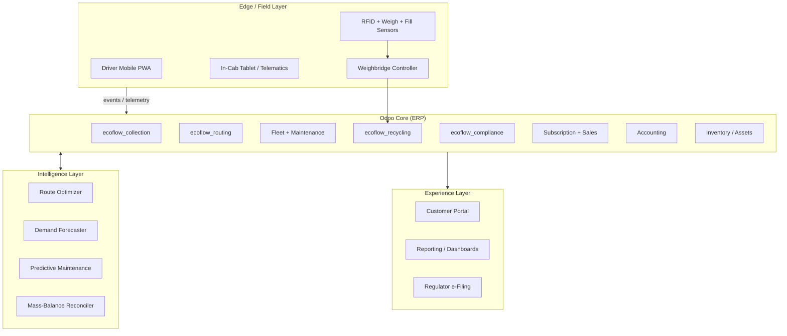
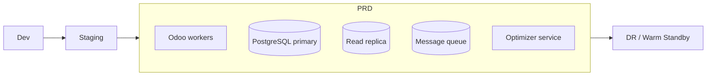

# 01 — System Architecture

## 1. Architectural Overview

ECOFLOW is a **layered, event-driven ERP** built on Odoo. The field is the edge,
Odoo is the core, and an analytics/optimization layer wraps both.

### Architectural style

- **Modular monolith on Odoo** for transactional integrity, extended by
  **stateless microservices** for compute-heavy optimization (routing, forecasting).
- **Event bus** (Odoo bus + message queue, e.g. RabbitMQ/Kafka) decouples field
  telemetry ingestion from transactional processing.
- **CQRS-lite**: write path through Odoo ORM; read path for analytics via a
  replicated reporting database (PostgreSQL read replica + materialized views).

---

## 2. Module Map

### 2.1 Reused Odoo modules

| Odoo App | ECOFLOW Use |
|----------|-------------|
| `fleet` | Vehicles, drivers, odometer, fuel, contracts |
| `maintenance` | Preventive + corrective maintenance work orders |
| `stock` | Bins, containers, skips, RFID assets, processed-material inventory |
| `sale_subscription` | Recurring service plans, MRR, upsell |
| `sale_management` | One-off services (bulk pickup, special waste) |
| `account` | Invoicing, weight-based billing, taxes/levies |
| `project` / `planning` | Crew scheduling, shift planning |
| `quality` | Contamination checks, load rejection |
| `documents` | Manifests, certificates, permits |
| `iot` | Weighbridge, sensors, in-cab device bridge |

### 2.2 Custom ECOFLOW modules

| Module | Responsibility | Key Models |
|--------|----------------|-----------|
| `ecoflow_collection` | Service catalog, service orders, bin lifecycle | `ecoflow.service`, `ecoflow.service.order`, `ecoflow.bin` |
| `ecoflow_routing` | Route plans, optimization, live dispatch | `ecoflow.route`, `ecoflow.route.stop`, `ecoflow.route.run` |
| `ecoflow_weighbridge` | Inbound/outbound weighing, tickets | `ecoflow.weigh.ticket`, `ecoflow.weighbridge` |
| `ecoflow_recycling` | Material recovery, MRF processing, diversion | `ecoflow.material`, `ecoflow.process.batch`, `ecoflow.recovery` |
| `ecoflow_compliance` | Manifests, waste codes, permits, audits | `ecoflow.manifest`, `ecoflow.waste.code`, `ecoflow.permit` |
| `ecoflow_field` | Driver PWA backend, ePOD, exceptions | `ecoflow.field.task`, `ecoflow.exception` |

Each custom module declares dependencies explicitly and ships demo + test data.

---

## 3. Technology Stack

| Concern | Choice | Rationale |
|---------|--------|-----------|
| ERP core | Odoo 17/18 (Enterprise) | Mature fleet, subscription, accounting |
| Database | PostgreSQL 15+ | Odoo native; read replica for BI |
| Optimization service | Python + OR-Tools (VRP solver) | Best-in-class vehicle routing |
| Geospatial | PostGIS + OSRM/Valhalla | Drive-time matrices, map matching |
| Messaging | RabbitMQ / Kafka | Telemetry ingestion at scale |
| Field app | PWA (offline-first) + Service Workers | Works in low-coverage zones |
| Telematics | OEM API / Geotab / Samsara connector | GPS, fuel, engine health |
| IoT bridge | MQTT → Odoo IoT box | Sensors, weighbridge |
| BI | Odoo Spreadsheet + Metabase/Superset | Operational + executive dashboards |
| Maps/UI | Leaflet/Mapbox in OWL components | Live dispatch board |

---

## 4. Environments & Deployment

- **Containerized** (Docker/Kubernetes) for Odoo workers + optimizer service.
- **Blue/green** deploys for zero-downtime field operations.
- **Autoscaling** optimizer pods during morning route-cutting peak.
- **Backups**: continuous WAL archiving; nightly logical dumps; tested restores.
- **DR**: warm standby with streaming replication, RPO ≤ 5 min, RTO ≤ 1 hr.

---

## 5. Event Catalog (backbone of automation)

| Event | Emitter | Consumers |
|-------|---------|-----------|
| `bin.serviced` | Field PWA | Billing, compliance, routing progress |
| `weigh.captured` | Weighbridge | Recycling, billing, mass-balance |
| `route.deviation` | Telematics | Dispatch, customer ETA, exception desk |
| `vehicle.fault` | Telematics/IoT | Maintenance, dispatch reassignment |
| `manifest.closed` | Compliance | Reporting, regulator filing |
| `subscription.renewed` | Subscription | Demand forecast, capacity planning |
| `contamination.flagged` | Quality/Field | Recycling, customer notice, billing surcharge |

Events are the contract that keeps modules decoupled and operations real-time.

---

*Next: [02 — Data Model](02-data-model.md)*
