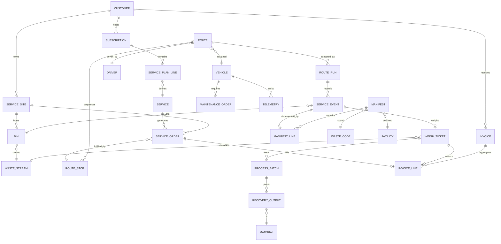

# 02 — Data Model

The ECOFLOW data model is anchored on six entity clusters: **Customer & Contract**,
**Service & Collection**, **Routing & Execution**, **Fleet & Assets**,
**Material & Recycling**, and **Compliance**. All weight, time, and cost flow
through a single transactional spine.

---

## 1. Entity-Relationship Diagram



---

## 2. Core Entity Dictionary

### 2.1 Customer & Contract

| Entity | Key Fields | Notes |
|--------|-----------|-------|
| `CUSTOMER` (`res.partner`) | name, type (residential/commercial/municipal), account_status, credit_terms | Extends Odoo partner |
| `SERVICE_SITE` | partner_id, geo_point (PostGIS), access_notes, zone_id, gate_code | Physical pickup location |
| `SUBSCRIPTION` | partner_id, plan, recurrence, start/end, mrr, status | Odoo `sale.subscription` |
| `SERVICE_PLAN_LINE` | subscription_id, service_id, frequency, qty, price | One line per recurring service |

### 2.2 Service & Collection

| Entity | Key Fields | Notes |
|--------|-----------|-------|
| `SERVICE` | code, name, waste_stream_id, container_type, billing_method (flat/weight/lift), sla | Catalog item |
| `WASTE_STREAM` | code, name, hazard_class, recyclable (bool), default_waste_code | MSW, recycling, organics, C&D, hazardous, e-waste |
| `BIN` | rfid_tag, serial, capacity_l, type, site_id, status, last_serviced | Tracked asset (`stock.lot`) |
| `SERVICE_ORDER` | site_id, service_id, scheduled_date, status, priority, route_stop_id | Demand unit |

### 2.3 Routing & Execution

| Entity | Key Fields | Notes |
|--------|-----------|-------|
| `ROUTE` | code, date, zone_id, vehicle_id, driver_id, status, planned_distance, planned_duration | Daily plan |
| `ROUTE_STOP` | route_id, sequence, service_order_id, eta, service_time, geo_point | Ordered stop |
| `ROUTE_RUN` | route_id, actual_start, actual_end, actual_distance, fuel_used | Execution instance |
| `SERVICE_EVENT` | route_run_id, bin_id, timestamp, geo_point, status, photo, exception_id | The atomic "bin lifted" fact |
| `EXCEPTION` | type (blocked/contaminated/overweight/missed), note, resolution | Field deviations |

### 2.4 Fleet & Assets

| Entity | Key Fields | Notes |
|--------|-----------|-------|
| `VEHICLE` (`fleet.vehicle`) | plate, type (rear/side/front loader, roll-off), capacity_kg, compartments, status | |
| `DRIVER` | partner_id, license_class, certifications, shift_pattern | |
| `MAINTENANCE_ORDER` | vehicle_id, type (PM/CM), due (km/date), status, cost | Odoo `maintenance.request` |
| `TELEMETRY` | vehicle_id, ts, geo, speed, fuel, engine_health, dtc_codes | High-volume; stored in time-series partition |

### 2.5 Material & Recycling

| Entity | Key Fields | Notes |
|--------|-----------|-------|
| `WEIGH_TICKET` | source (event/inbound/outbound), gross, tare, net, waste_stream_id, facility_id, ts | Mass capture |
| `PROCESS_BATCH` | facility_id, input_stream, input_kg, start/end, line_id | MRF processing run |
| `RECOVERY_OUTPUT` | batch_id, material_id, recovered_kg, grade, bale_id | Saleable output |
| `MATERIAL` | code, name (PET/HDPE/OCC/aluminium/glass), market_price, uom | Commodity master |
| `RESIDUAL` | batch_id, residual_kg, disposal_facility_id | Non-recoverable remainder |

### 2.6 Compliance

| Entity | Key Fields | Notes |
|--------|-----------|-------|
| `WASTE_CODE` | code (e.g. EWC/EPA), description, hazard_flag, regulator | Regulatory classification |
| `MANIFEST` | number, generator_id, transporter_id, facility_id, status, sign_chain | Chain-of-custody doc |
| `MANIFEST_LINE` | manifest_id, waste_code_id, qty_kg, container_count, service_event_id | |
| `PERMIT` | type, number, holder, valid_from/to, scope, status | Operating/transport/site permits |
| `AUDIT_RECORD` | entity, event, actor, ts, before/after | Immutable audit trail |

---

## 3. Mass-Balance Invariant

A non-negotiable data rule binds collection to recovery and disposal:

```
Σ collected_net (weigh tickets, inbound)
  = Σ recovered_kg (recovery outputs)
  + Σ residual_kg (to disposal)
  + Δ inventory (stockpile change)
  ± tolerance (moisture/shrinkage, configurable)
```

The **Mass-Balance Reconciler** runs nightly and flags any imbalance beyond
tolerance as a compliance exception. This single invariant is what makes
diversion reporting auditable and revenue leakage detectable.

---

## 4. Identity & Keys

- **Bins** keyed by RFID tag → enables touchless service capture and proof.
- **Service events** carry geo + timestamp + bin → immutable proof-of-service.
- **Weigh tickets** link event → stream → facility → manifest, closing the loop
  from kerbside to certificate.

---

*Next: [03 — Capabilities](03-capabilities.md)*
