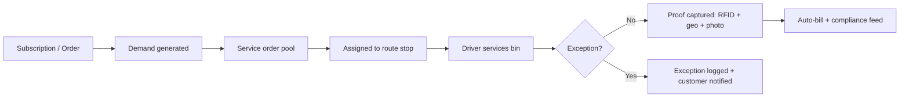
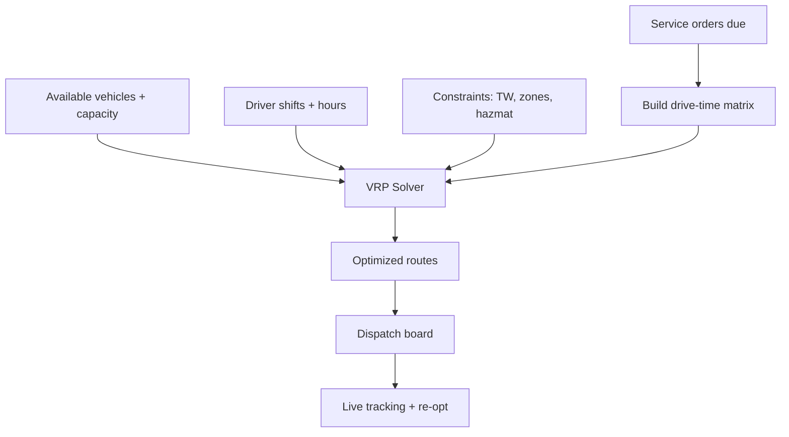
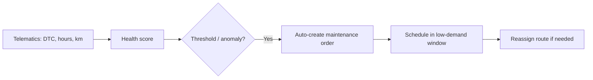
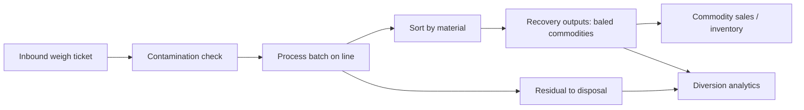
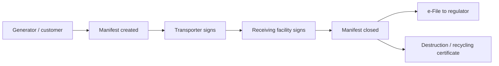

# 03 — Capability Specifications

Functional specs for the seven ECOFLOW capabilities. Each section states the
**purpose**, **key workflows**, **automation rules**, and **efficiency levers**.

---

## 1. Collection

**Purpose:** Ensure the correct waste stream is collected from each site on time,
with verifiable proof and minimal back-office effort.

### Workflows

### Key features

- **Service catalog** with billing method per service (flat, per-lift, per-kg).
- **Bin lifecycle**: delivery → in-service → swap → suspend → retrieve, fully tracked.
- **Touchless proof-of-service**: RFID scan + GPS + optional photo = immutable event.
- **Exception taxonomy**: blocked access, overfilled, contaminated, missed, damaged bin.
- **Dynamic frequency**: fill-level sensors can trigger or skip a scheduled lift.

### Automation rules

| Trigger | Action |
|---------|--------|
| Subscription active | Generate recurring service orders per frequency |
| Bin not serviced by SLA | Escalate to missed-collection workflow + credit rule |
| Contamination flagged | Apply surcharge, notify customer, route to recycling QA |
| Fill sensor ≥ threshold | Insert on-demand stop into next eligible route |

### Efficiency levers
- Skip empty bins via fill-level data → fewer wasted lifts.
- Photo + RFID proof eliminates "you missed me" disputes and credits.

---

## 2. Routing

**Purpose:** Service the maximum number of stops at the minimum cost while
respecting vehicle capacity, time windows, and driver hours.

### Optimization model

ECOFLOW solves a **Capacitated Vehicle Routing Problem with Time Windows
(CVRPTW)** using OR-Tools, fed by an OSRM/Valhalla drive-time matrix over PostGIS.

### Constraints handled
- Vehicle capacity (kg + volume + compartments for split streams).
- Customer/zone time windows and access restrictions.
- Driver legal driving hours and break rules.
- Hazardous-material vehicle/driver certification matching.
- Disposal/MRF facility cut-off times and tip-floor capacity.

### Modes
- **Static (master routes):** weekly recurring residential routes.
- **Dynamic (daily cut):** commercial + on-demand reoptimized each morning.
- **Live re-route:** breakdown, traffic, or new urgent order triggers partial re-solve.

### Efficiency levers
- Route density: stops per hour ↑, deadhead km ↓.
- Backhaul logic: collect on outbound, tip on return, avoid empty miles.
- Continuous geocoding + map-matching keeps the matrix accurate.

---

## 3. Fleet

**Purpose:** Keep the right vehicles and assets available, safe, compliant, and
cost-efficient.

### Scope
- **Vehicle master**: rear/side/front loaders, roll-off, vacuum, compactors.
- **Asset master**: bins, skips, compactors, balers, RFID tags.
- **Maintenance**: preventive (km/hours/calendar) + corrective work orders.
- **Fuel & energy**: fuel cards, EV charging, cost per km/route.
- **Driver management**: licences, certifications, shift patterns, safety scores.

### Predictive maintenance loop

### Automation rules
| Trigger | Action |
|---------|--------|
| Odometer/engine-hours threshold | Raise preventive maintenance order |
| Fault code (DTC) received | Raise corrective order + flag dispatch |
| Permit/inspection expiring | Block dispatch + notify fleet manager |
| Vehicle down | Auto-suggest spare + re-route affected stops |

### Efficiency levers
- Uptime ↑ via predictive vs. reactive maintenance.
- Right-sizing: match vehicle capacity to route demand profile.
- Fuel/idle analytics per driver and route.

---

## 4. Recycling

**Purpose:** Maximize diversion from landfill and the value recovered from
collected material.

### MRF / processing flow

### Key features
- **Inbound/outbound weighing** with stream classification.
- **Batch processing** records input, line, time, and yields.
- **Recovery outputs** tracked as inventory (bales, grades) → sellable commodities.
- **Residual tracking** feeds disposal cost and mass balance.
- **Commodity pricing** integration for margin per material.

### Automation rules
| Trigger | Action |
|---------|--------|
| Inbound ticket posted | Create draft process batch for the stream |
| Batch closed | Compute yield %, post recovery outputs to inventory |
| Recovery output baled | Generate commodity lot + market valuation |
| Mass-balance gap | Flag reconciliation exception |

### Efficiency levers
- Diversion rate and recovery yield as primary operating metrics.
- Contamination surcharge recovery + targeted customer education.
- Commodity timing: sell when market price favorable using inventory buffer.

---

## 5. Compliance

**Purpose:** Make regulatory adherence automatic, provable, and audit-ready.

### Chain of custody

### Key features
- **Waste classification** library (EWC/EPA/local codes) with hazard flags.
- **Electronic manifests** with multi-party digital signatures and timestamps.
- **Permit register**: operating, transport, site, and driver certifications with
  expiry-driven blocking.
- **Immutable audit trail** on every regulated entity (who/what/when/before/after).
- **Certificate generation**: destruction, recycling, and diversion certificates
  produced from operational data.

### Automation rules
| Trigger | Action |
|---------|--------|
| Hazardous service event | Require manifest before route close |
| Manifest unsigned > SLA | Escalate to compliance officer |
| Permit within 30 days of expiry | Notify + block scheduling on expiry |
| Regulator report period end | Auto-assemble and submit filing |

### Efficiency levers
- Manifests generated from existing field data = zero duplicate entry.
- Expiry automation prevents costly non-compliance fines and stoppages.

---

## 6. Customer Subscriptions

**Purpose:** Drive predictable recurring revenue and feed demand forecasting.

### Subscription lifecycle

### Key features
- **Plan catalog**: residential, commercial, municipal, event-based.
- **Hybrid billing**: flat recurring + metered (per-kg/per-lift) overage.
- **Self-service portal**: schedule changes, extra pickups, invoices, ESG reports.
- **Contract management**: terms, escalators, levies, fuel surcharges.
- **Dunning & credit control** integrated with Odoo accounting.

### Automation rules
| Trigger | Action |
|---------|--------|
| Subscription active | Generate service demand for routing |
| Metered overage detected | Add line to next invoice |
| Payment failed | Trigger dunning + service-hold policy |
| Renewal upcoming | Generate renewal quote + upsell suggestion |

### Efficiency levers
- MRR predictability → capacity and fleet planning accuracy.
- Self-service deflects call-centre load and "extra pickup" admin.
- Subscriptions become the demand signal for the forecaster.

---

## 7. Reporting

**Purpose:** One source of truth for operations, finance, compliance, and ESG —
fast enough to drive daily decisions.

### Report families

| Audience | Reports |
|----------|---------|
| **Operations** | Route adherence, cost per stop/lift/tonne, missed collections, exceptions |
| **Fleet** | Uptime, maintenance cost/km, fuel & idle, driver safety |
| **Recycling** | Diversion rate, recovery yield, contamination, commodity margin |
| **Compliance** | Manifest closure, permit status, audit log, regulator filings |
| **Finance** | MRR, churn, AR aging, revenue per route, margin per service |
| **Customer/ESG** | Tonnes diverted, CO₂e avoided, recycling certificates |

### Delivery
- **Live dispatch board** (map + ETA + exceptions) for real-time control.
- **Operational dashboards** refreshed from the read replica + materialized views.
- **Executive scorecard** anchored on the Operational Efficiency Index (OEI).
- **Customer ESG portal**: each account sees its own diversion and CO₂e impact.
- **Scheduled exports** to regulators and large municipal clients.

### Efficiency levers
- Time-to-insight measured in minutes, not days.
- Every KPI traces back to a transactional event (no spreadsheet reconciliation).

---

*Next: [04 — Operational Efficiency Engine](04-operational-efficiency.md)*
