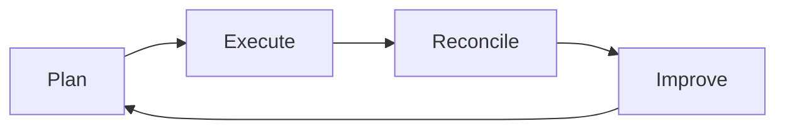
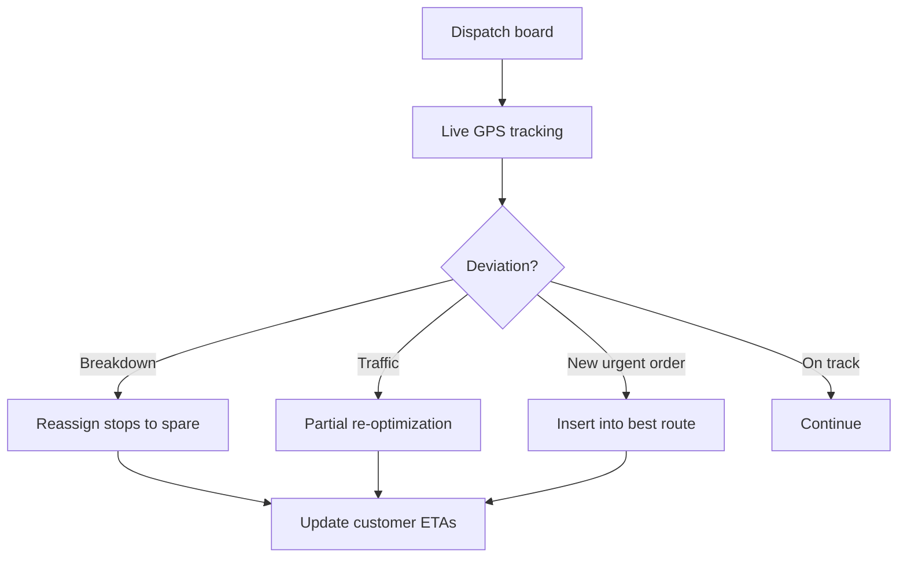

# 04 — Operational Efficiency Engine

This is the heart of ECOFLOW. Every other module exists to feed the efficiency
engine and act on its output. The engine has four loops: **Plan, Execute,
Reconcile, Improve.**



---

## 1. The Operational Efficiency Index (OEI)

A single composite KPI the whole company steers by:

```
OEI = w1·RouteDensity + w2·OnTime% + w3·RecoveryRate
      + w4·VehicleUptime% − w5·CostPerTonne − w6·ExceptionRate
```

- Weights (`w1..w6`) are tunable per business model (municipal vs. commercial).
- OEI is computed daily from transactional events and displayed on the executive
  scorecard with drill-down to the responsible route, vehicle, or site.

---

## 2. Plan Loop — squeeze cost out before the wheels turn

| Lever | Mechanism | Efficiency gain |
|-------|-----------|-----------------|
| Route optimization | CVRPTW solver (OR-Tools) | ↓ distance, ↓ overtime |
| Demand forecasting | Subscription + seasonality model | ↓ over/under-capacity |
| Capacity matching | Vehicle profile ↔ route demand | ↓ partial loads, ↓ trips |
| Fill-level driven scheduling | Sensor threshold inserts/skips stops | ↓ wasted lifts |
| Facility load balancing | Tip cut-off + queue awareness | ↓ wait time at MRF |

### Demand forecaster
- Inputs: active subscriptions, historical fill rates, seasonality, events,
  weather.
- Output: predicted volume per zone/stream/day → drives route count and crew rota.
- Reduces both **missed collections** (under-provision) and **idle trucks**
  (over-provision).

---

## 3. Execute Loop — control the day in real time



- **In-cab guidance**: turn-by-turn with stop sequence + service instructions.
- **Touchless capture**: RFID + geo + photo = proof-of-service with no paperwork.
- **Exception desk**: structured exceptions routed to the right team instantly.
- **Customer ETAs**: live notifications cut inbound "where's my truck" calls.

---

## 4. Reconcile Loop — close every gram and every dollar

The reconcile loop is what turns raw activity into trustworthy numbers.

| Reconciliation | Rule | Catches |
|----------------|------|---------|
| **Mass balance** | collected = recovered + residual + Δinventory ± tol | leakage, misclassification |
| **Service ↔ billing** | every billable event invoiced | revenue leakage |
| **Weight ↔ manifest** | manifest qty = sum of event weights | compliance gaps |
| **Route plan ↔ actual** | planned vs. executed stops/km | productivity loss |
| **Fuel ↔ distance** | fuel per km within band | theft / inefficiency |

Exceptions are auto-created and assigned; nothing silently drops.

---

## 5. Improve Loop — continuous optimization

- **Route learning**: actual service times feed back into the solver's estimates.
- **Driver coaching**: safety + idle + service-time scorecards.
- **Contamination targeting**: repeat-offender sites get education + surcharge.
- **Commodity timing**: hold/sell decisions based on price + inventory.
- **Network design**: periodic facility-siting and zone-rebalancing analysis.

---

## 6. Automation Catalogue (server actions / scheduled jobs)

| Job | Cadence | Effect |
|-----|---------|--------|
| Generate recurring service orders | Daily | Demand pool ready for routing |
| Cut & optimize daily routes | Nightly / on-demand | Optimized plans before shift |
| Ingest telematics + sensors | Streaming | Live tracking, health scoring |
| Predictive maintenance scan | Daily | Pre-empt breakdowns |
| Mass-balance reconciliation | Nightly | Diversion + leakage integrity |
| Auto-invoice serviced orders | Daily | Revenue capture, no re-entry |
| Permit/inspection expiry scan | Daily | Compliance blocking |
| Regulator filing assembly | Per period | Hands-off compliance reporting |
| OEI recompute + scorecard | Daily | Single steering metric |

---

## 7. Efficiency Targets (illustrative)

| Metric | Baseline | Target |
|--------|----------|--------|
| Cost per stop | — | −15% in 12 months |
| Route density (stops/hr) | — | +20% |
| Vehicle uptime | — | ≥ 95% |
| Diversion rate | — | +10 pts |
| Missed collections | — | < 0.5% |
| Invoice leakage | — | < 0.2% |
| Manifest closure within SLA | — | ≥ 99% |

---

*Next: [05 — Integrations, Security & Reporting](05-integrations-security-reporting.md)*
