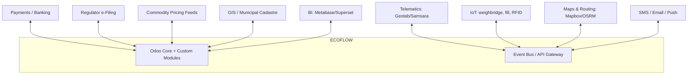
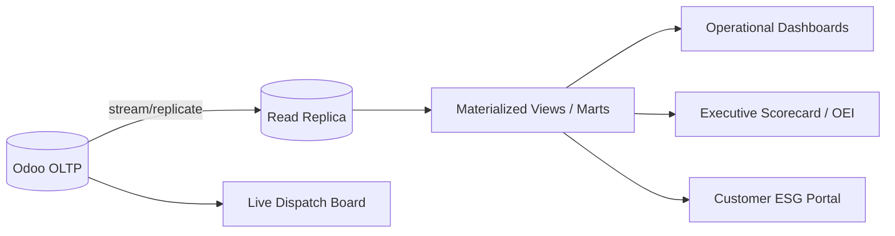

# 05 — Integrations, Security & Reporting

## 1. Integration Landscape

### Integration patterns
- **Inbound telemetry**: MQTT/HTTP → event bus → normalized → Odoo models.
- **Outbound documents**: manifests/certificates → regulator portals via API/SFTP.
- **Sync**: customer + billing master via REST; idempotent, retried, audited.
- **API gateway**: rate-limited, OAuth2-secured public API for partners and the
  customer portal.

### Key connectors
| Connector | Direction | Purpose |
|-----------|-----------|---------|
| Telematics | In | GPS, fuel, engine health, DTCs |
| Weighbridge (IoT box) | In | Gross/tare/net tickets |
| Fill-level sensors | In | Dynamic scheduling |
| RFID readers | In | Touchless proof-of-service |
| Routing engine (OSRM/Valhalla) | In/Out | Drive-time matrix, turn-by-turn |
| Payment gateway | In/Out | Subscription billing, dunning |
| Regulator e-manifest | Out | Compliance filing |
| Commodity pricing | In | Recovery valuation |
| Notification provider | Out | ETAs, alerts, dunning |

---

## 2. Security & Compliance Architecture

### 2.1 Access control
- **RBAC** via Odoo groups: Dispatcher, Driver, Fleet Manager, Compliance Officer,
  Recycling Operator, Finance, Customer (portal), Admin.
- **Record rules** scope data by zone/depot/company (multi-company ready).
- **Field-level security** on sensitive fields (pricing, hazardous data).
- **Least privilege** by default; elevation is logged.

### 2.2 Data protection (OWASP-aligned)
- **Input validation** at every boundary (API, portal, IoT ingestion).
- **Parameterized ORM** only — no raw SQL string concatenation.
- **Output encoding** in portal/templates to prevent XSS.
- **CSRF protection** on all state-changing web routes.
- **Secrets** in a vault / environment variables — never in source.
- **Encryption**: TLS in transit; at-rest encryption for DB + document store.
- **PII minimization**: customer data segregated; retention policies enforced.

### 2.3 Auditability
- Immutable `AUDIT_RECORD` on all regulated entities.
- Tamper-evident signature chain on manifests.
- IoT/telemetry events are append-only.

### 2.4 Resilience
- Offline-first field PWA with conflict-safe sync queue.
- Idempotent event processing (dedupe keys) so retries never double-bill.
- Rate limiting + backpressure on telemetry ingestion.

### Security checklist (pre-go-live)
- [ ] No hardcoded secrets; vault configured
- [ ] All inputs validated at boundaries
- [ ] RBAC + record rules tested per role
- [ ] TLS enforced end-to-end; HSTS enabled
- [ ] Audit trail verified immutable
- [ ] Backups + restore drill passed
- [ ] Rate limiting on public API + ingestion
- [ ] PII retention + erasure workflow in place

---

## 3. Reporting & Analytics Layer

### 3.1 Architecture

- **Read replica** isolates heavy analytics from transactional performance.
- **Materialized marts** per domain (operations, fleet, recycling, finance).
- **Live board** reads OLTP directly for real-time dispatch.

### 3.2 Semantic model (key measures)
| Measure | Definition |
|---------|-----------|
| Cost per tonne | (fleet + labour + disposal) ÷ tonnes serviced |
| Route density | serviced stops ÷ route hours |
| Diversion rate | recovered ÷ (recovered + residual) |
| Vehicle uptime | available hours ÷ scheduled hours |
| On-time % | stops within window ÷ total stops |
| MRR / churn | recurring revenue / lost subscriptions |
| CO₂e avoided | diversion × emission factors |

### 3.3 Distribution
- Role-based dashboards in Odoo + Metabase/Superset.
- Scheduled PDF/CSV exports to municipal clients and regulators.
- Customer ESG reports auto-generated per billing cycle.
- Alerting on KPI breach (e.g., uptime < target, leakage > threshold).

---

*Next: [06 — Roadmap & KPIs](06-roadmap.md)*
