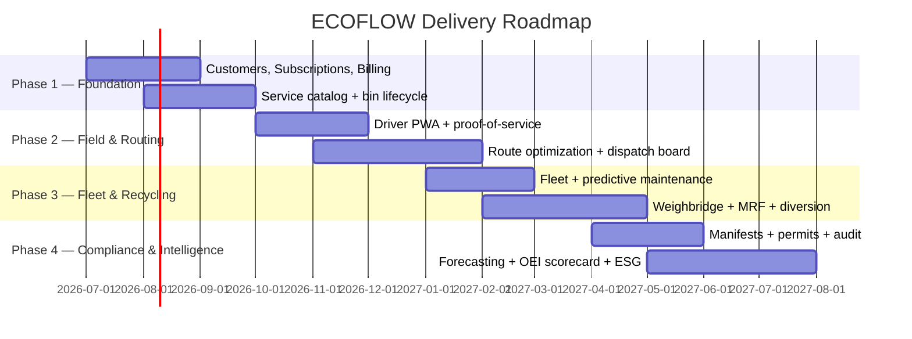
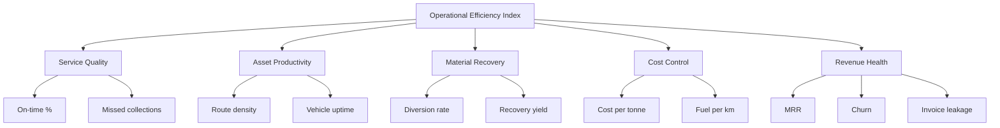

# 06 — Roadmap, Delivery & KPIs

## 1. Phased Delivery

### Phase outcomes
| Phase | Goal | Exit criteria |
|-------|------|---------------|
| **1 — Foundation** | Revenue spine live | Subscriptions billing, services cataloged, bins tracked |
| **2 — Field & Routing** | Operations digitized | Touchless proof-of-service; optimized daily routes |
| **3 — Fleet & Recycling** | Assets + material under control | Predictive maintenance live; diversion measured |
| **4 — Compliance & Intelligence** | Auditable + self-optimizing | Auto-manifests; OEI scorecard; ESG portal |

Each phase is independently valuable — no big-bang cutover.

---

## 2. Delivery Approach

- **MVP per capability**, then deepen — ship the thinnest useful slice first.
- **TDD** for custom modules: unit + integration tests, ≥ 80% coverage target.
- **Staging mirrors production**; field changes validated with real route data.
- **Pilot depot** before fleet-wide rollout; measure OEI delta before scaling.
- **Change management**: driver + dispatcher training built into each phase.

---

## 3. RACI (per capability stream)

| Activity | Ops Architect | Dev Team | Fleet Mgr | Compliance | Finance |
|----------|:---:|:---:|:---:|:---:|:---:|
| Blueprint & data model | A/R | C | C | C | C |
| Module build | C | R | I | I | I |
| Routing tuning | A | R | C | I | I |
| Fleet/maintenance config | C | R | A/R | I | I |
| Compliance rules | C | R | I | A/R | I |
| Billing & subscriptions | C | R | I | I | A/R |
| Go-live sign-off | A | R | C | C | C |

*A=Accountable, R=Responsible, C=Consulted, I=Informed.*

---

## 4. KPI Tree (what success looks like)

### Target scorecard
| Domain | KPI | Target |
|--------|-----|--------|
| Service | On-time % | ≥ 97% |
| Service | Missed collections | < 0.5% |
| Productivity | Route density | +20% vs baseline |
| Productivity | Vehicle uptime | ≥ 95% |
| Recovery | Diversion rate | +10 pts |
| Recovery | Recovery yield | ≥ 85% of input |
| Cost | Cost per tonne | −15% |
| Compliance | Manifest closure within SLA | ≥ 99% |
| Revenue | Invoice leakage | < 0.2% |
| Revenue | Net revenue retention | ≥ 100% |

---

## 5. Risk Register (top items)

| Risk | Impact | Mitigation |
|------|--------|------------|
| Poor address/geocode data | Bad routes | Geocoding QA + map-matching feedback |
| Driver adoption of PWA | Lost proof data | Simple UX, offline mode, training, incentives |
| Telematics integration gaps | Blind spots | Vendor-agnostic connector + fallback manual capture |
| Regulatory variation by region | Compliance gaps | Configurable waste-code + manifest engine |
| Optimizer over-tightening routes | Driver burnout / SLA misses | Buffered time windows, human-in-the-loop dispatch |
| Commodity price volatility | Margin swings | Inventory buffer + timed selling |

---

## 6. Definition of Done (program level)

- [ ] All 7 capabilities live and integrated end-to-end
- [ ] Single proof-of-service event drives billing + compliance + analytics
- [ ] Mass balance reconciles within tolerance nightly
- [ ] OEI scorecard live with drill-down
- [ ] Customer self-service + ESG portal in production
- [ ] Security checklist passed; DR drill successful
- [ ] Pilot depot shows measurable OEI improvement before scale-out

---

*ECOFLOW — from kerbside to certificate, optimized at every step.*
