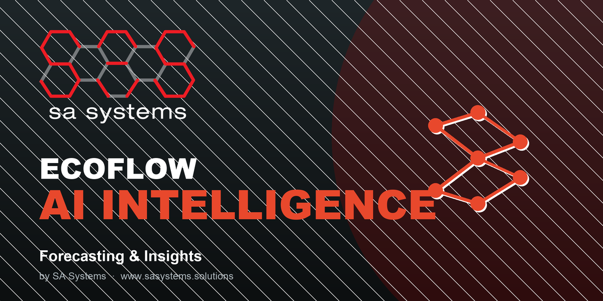

# ECOFLOW AI Intelligence

> AI-powered demand forecasting, smart dispatch, anomaly detection and operational insights for ECOFLOW.

Part of the **ECOFLOW by SA Systems** environmental-operations suite for Odoo.



## Features

- Demand forecasting per zone & waste stream (trend + seasonality)
- Predictive bin fill-levels and smart collection recommendations
- Route efficiency scoring and savings estimation
- Anomaly detection (contamination, mass-balance drift, missed pickups)
- Plain-language AI insights engine
- Region-aware intelligence (framework, units & default currency)

## Compatibility

- **Odoo 19.0** (Community & Enterprise).
- Manifest version `19.0.1.0.0` matches the `19.0` series branch.
- No external Python dependencies.

## Dependencies

`ecoflow_dashboard`

## Installation

This module is part of the ECOFLOW suite. Install **ECOFLOW** from the Apps menu
(the Dashboard app pulls in its dependencies), or install this module directly:

```bash
odoo -d ecoflow -i ecoflow_ai --stop-after-init
```

## License & Support

Published by **SA Systems** under the **OPL-1** license as a **free add-on** to the ECOFLOW suite — unlocked by the one paid app, **ECOFLOW Base**.

- Web: https://sasystems.solutions/custom-web-app-development
- Support: info@sasystems.solutions
