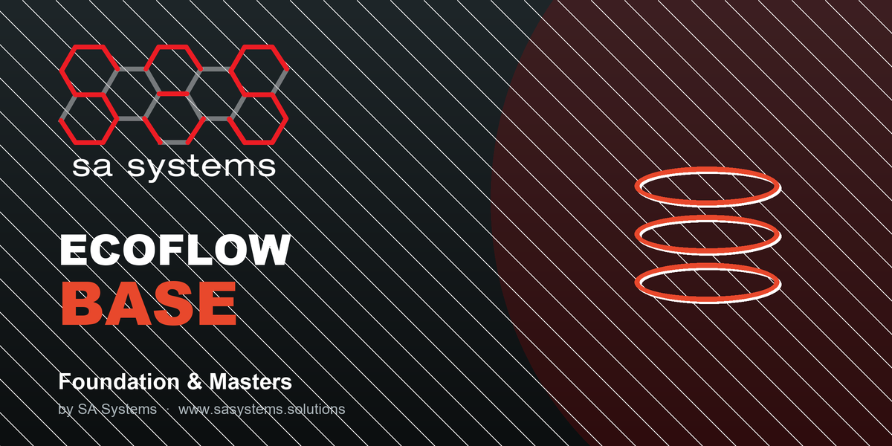

# ECOFLOW Base

> Shared foundation for the ECOFLOW environmental operations ERP

Part of the **ECOFLOW by SA Systems** environmental-operations suite for Odoo.



## Features

- Waste-stream and recoverable-material masters (with market price / tonne)
- Service zones and bin / container registry
- Partner (service-site) extensions
- Multi-currency commodity pricing

## Compatibility

- **Odoo 18.0** (Community & Enterprise).
- Manifest version `18.0.1.0.0` matches the `18.0` series branch.
- No external Python dependencies.

## Dependencies

`base`, `mail`, `stock`

## Installation

This module is part of the ECOFLOW suite. Install **ECOFLOW** from the Apps menu
(the Dashboard app pulls in its dependencies), or install this module directly:

```bash
odoo -d ecoflow -i ecoflow_base --stop-after-init
```

## License & Support

Published by **SA Systems** under the **OPL-1** license. This is the **single paid app** for the entire ECOFLOW suite ($299.00 USD). Purchasing it unlocks every other ECOFLOW module as a free add-on.

- Web: https://sasystems.solutions/custom-web-app-development
- Support: info@sasystems.solutions
